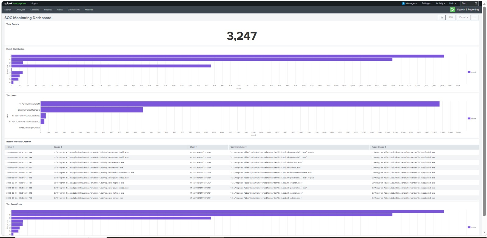
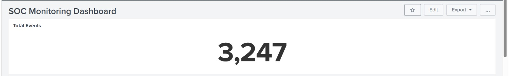
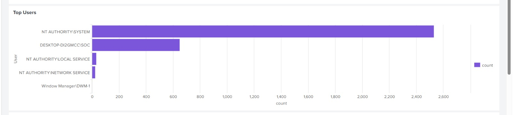
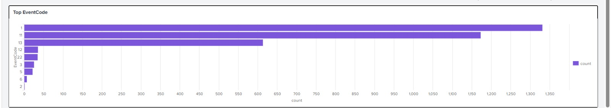
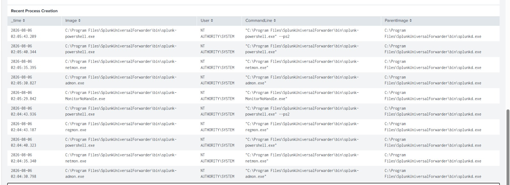

# Splunk SOC Home Lab

## Project Overview

This project demonstrates a basic Security Operations Center (SOC) monitoring environment using Splunk Enterprise.

The project includes:

- Windows Event Log collection
- Sysmon monitoring
- Splunk Universal Forwarder
- SPL Queries
- Security Dashboards
- Detection Use Cases

---

## Tools Used

- Splunk Enterprise
- Splunk Universal Forwarder
- Sysmon
- Windows 10
- PowerShell

---

## Dashboard

The dashboard contains:

- Total Events
- Event Code Distribution
- Top Users
- Top Event Code
- Recent Process Creation Events

---

## Skills Demonstrated

- Windows Log Analysis
- Security Monitoring
- SPL Query Writing
- Dashboard Creation
- Threat Detection
- SOC Investigation

---

## Project Structure

```
Documentation/
Screenshots/
README.md
```

---

## Screenshots

### SOC Dashboard



### Total Events



### Top Users



### Top Event IDs



### Recent Process Creation


---

## Author

Fatma Elzahraa Adel
SOC Analyst
