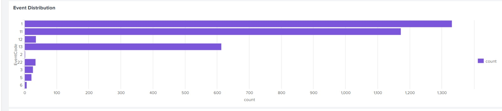

# Splunk SOC Home Lab

## Project Overview

This project demonstrates a Security Operations Center (SOC) monitoring environment built with Splunk Enterprise, progressing from foundational log collection to a real, working detection and alerting pipeline.

The project is organized into two phases:

- **Phase 1 — Environment Setup & Monitoring:** Windows log collection, Sysmon integration, and a general-purpose SOC monitoring dashboard.
- **Phase 2 — Brute Force Detection:** An end-to-end detection use case covering simulated attack activity, SPL-based detection logic, a real scheduled Splunk Alert, and a dedicated investigation dashboard.

---

## Tools Used

- Splunk Enterprise
- Splunk Universal Forwarder
- Sysmon
- Windows 10 (VMware Workstation VM)
- PowerShell / Command Prompt

---

## Phase 1: Environment Setup & Monitoring

### What was done

- Installed and configured **Sysmon** on a Windows 10 VM to generate detailed system telemetry (process creation, network connections, etc.).
- Installed the **Splunk Universal Forwarder** on the VM and configured it to forward Windows Event Logs and Sysmon logs to a central Splunk Enterprise instance.
- Verified log ingestion in Splunk (`index=main`) and confirmed multiple event types were arriving correctly (Sysmon Event Codes 1, 2, 3, 5, 6, 8, 11, 12, 13, 22, etc.).
- Built a general-purpose **SOC Monitoring Dashboard** to visualize overall log activity.

### Dashboard Contents

- Total Events
- Event Code Distribution
- Top Users
- Top Event Codes
- Recent Process Creation Events

### Screenshots

**SOC Dashboard**


**Total Events**


**Top Users**


**Top Event Codes**


**Event Code Distribution**


**Recent Process Creation**


---

## Phase 2: Brute Force / Failed Login Detection

### Objective

Detect repeated failed Windows login attempts (simulating a brute force attack) and turn that detection into a real, automatically-triggering Splunk Alert — not just a saved search.

### Attack Simulation

Since the Windows VM had autologin enabled, failed authentication attempts were generated locally using:

```cmd
runas /user:fakeuser cmd
```

An incorrect password was entered repeatedly (~15-20 times) to generate multiple **Event ID 4625 (Failed Logon)** events in the Windows Security Event Log.

### Log Source

- **Index:** `main`
- **Sourcetype:** `XmlWinEventLog:Security`
- **Event ID:** `4625` — An account failed to log on

### Detection Query (SPL)

```spl
index=main sourcetype="XmlWinEventLog:Security" "4625"
| rex field=_raw "TargetUserName'>(?<TargetUserName>[^<]+)"
| stats count by TargetUserName
| where count >= 5
| sort - count
```

This query extracts the target username from each failed logon event, counts attempts per user, and flags any username with **5 or more failed attempts** as suspicious brute-force activity.

### Investigation Findings

| Field | Value | Notes |
|---|---|---|
| Target Username | `fakeuser` | Consistently the targeted account across simulations |
| Failed Attempts | 18–20 per simulation | Well above the 5-attempt threshold |
| Source IP | `::1` | IPv6 loopback — confirms the activity was generated locally on the same host, not from a remote attacker |
| Event ID | 4625 | Failed Logon |

> **Note on Source IP:** `::1` indicates the simulated attack originated from the local machine itself, which is expected and correct for this home lab setup (the `runas` command was executed locally). In a production environment, a non-loopback source IP would indicate a genuine remote authentication attack.

### Alert Configuration

The detection was converted into a real, scheduled Splunk Alert:

| Setting | Value |
|---|---|
| Alert Type | Scheduled |
| Schedule | Cron: `*/5 * * * *` (every 5 minutes) |
| Time Range | Last 15 minutes |
| Trigger Condition | Number of Results > 0 |
| Trigger | Once |
| Action | Add to Triggered Alerts |

The alert was tested by generating a fresh batch of failed login attempts and confirming it fired automatically — **verified with two real trigger events** in the Trigger History.

### Investigation Dashboard

A dedicated dashboard was built to visualize the detection:

- **Failed Login Attempts by Username** — highlights which accounts are being targeted
- **Failed Login Attempts by Source IP** — identifies where attempts originate from
- **Failed Login Attempts Over Time** — shows the burst pattern typical of brute force activity

### Screenshots

**Simulated Attack (runas command)**


**Event ID 4625 Detail**


**Failed Logins by Username**


**Failed Logins by Source IP**


**Alert Configuration**


**Alert Enabled**


**Alert Trigger History (Proof it fired)**


**Final Detection Dashboard**


---

## Investigation Workflow (SOC L1 Analyst Perspective)

See [`Documentation/investigation-notes.md`](Documentation/investigation-notes.md) for the full step-by-step triage process an analyst would follow after this alert fires.

---

## Skills Demonstrated

- Windows Log Analysis
- Security Monitoring
- SPL Query Writing
- Detection Engineering
- Splunk Alerting & Scheduling
- Dashboard Creation
- SOC Investigation & Triage
- Log Source Integration (Universal Forwarder, Sysmon)

---

## Project Structure

```
SOC-Home-Lab/
├── README.md
├── Documentation/
│   └── investigation-notes.md
├── Screenshots/
│   ├── (Phase 1 - Environment & Monitoring)
│   └── (Phase 2 - Brute Force Detection)
└── SPL-Queries/
    └── brute_force_failed_login.spl
```

---

## Author

**Fatma Elzahraa Adel**
SOC Analyst 
